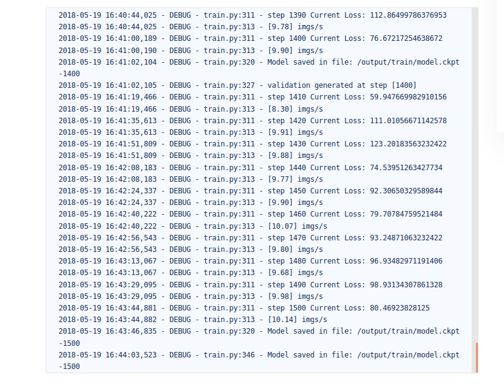

# zs_604486216_week10_work

在tinymid上运行网址为：https://www.tinymind.com/executions/tpu56fu8

数据集网址：https://www.tinymind.com/zhangsen4698/datasets/zs-week10-dataset

运行结果为：

运行的log内容：

原图:

标签

预测

CRF之后的预测

